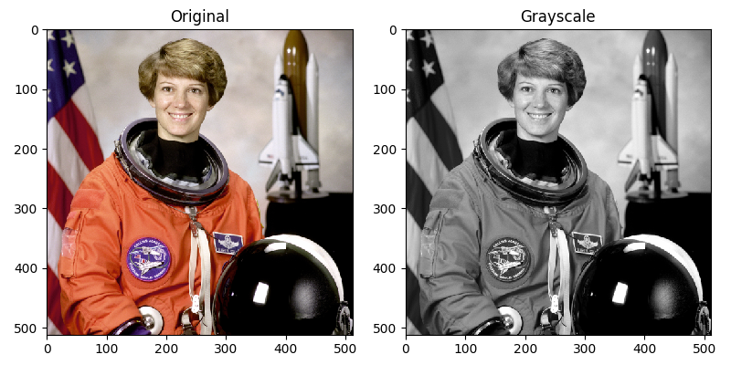

# Batch Image De-saturator
###### Simple Python program created to quickly transform multiple RGB images to Grayscale!

Very useful for image classifier training dataset preparation, OpenCV and reference key frame mapping.

### How to Use:

1. If you are using Windows or Mac and have not installed Python yet, you can do so from [Here](www.python.org/downloads/), make sure to install pip with the installer and add variable to PATH

2. Install Pillow using pip

   `pip install Pillow`

3. Clone/download this repository to your desktop

4. Drop the images you wish to desaturate directly into the script and give them a name as show in the proof of concept video

5. Done!

   

### Where to Find Me:

* [Telegram Contact 🔵](https://t.me/mekhyw)
* [YouTube Channel 🔴](https://www.youtube.com/channel/UC3__YPhMGjytXUqRUmriQ8A?view_as=subscriber)
* [Twitter Page 🐦](https://twitter.com/MekhyW)
* [Instagram Page 📸](https://www.instagram.com/mekhy_w/)

